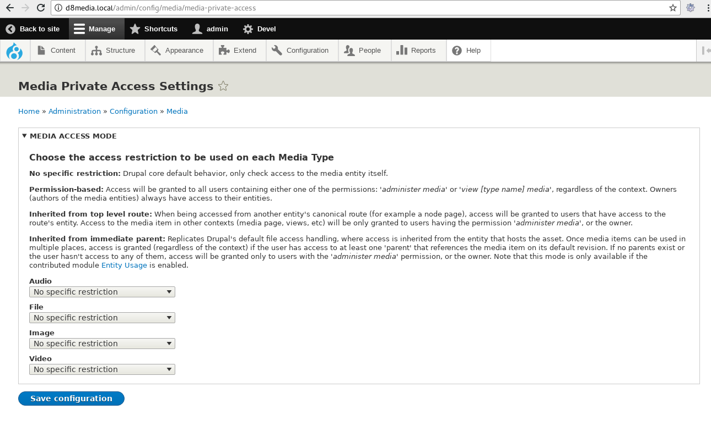
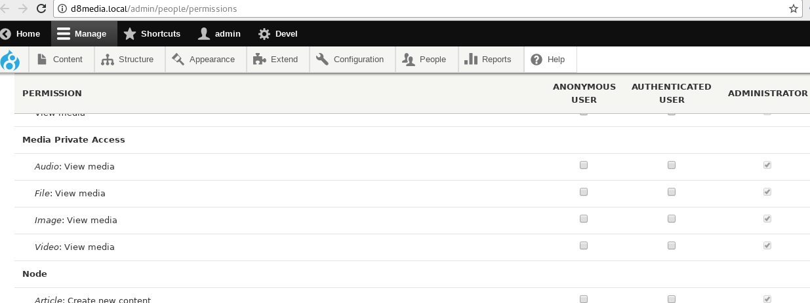

# Media Private Access

## Important!

This is a proof-of-concept / sandbox project. Use this at your own risk.

## About this Module

This project is intended to explore ways of addressing the access handling of
private media assets.

As shown in some [recent](https://drupal.org/node/2904842)
 [issues](https://drupal.org/node/2937642), users may expect from media assets
 the same behavior that Drupal core provided when handling access to private
 files.

This is not the case, and this project exposes some tools to site
 administrators allowing them to deal with some of the affected scenarios.

## Installation & Usage

After enabling this module, you will have the ability to configure the access
mode to be used for each of your Media types. Navigate to "Configuration ->
Media -> Media Private Access Settings" (or go to
`/admin/config/media/media-private-access` ), and configure your options there.

A description of how each access mode works can be found on that page.

New "view" permissions are created for every Media type:

These new permissions can be used in conjunction with the "Permission-based"
access mode.

## @todo 

Finish me.
